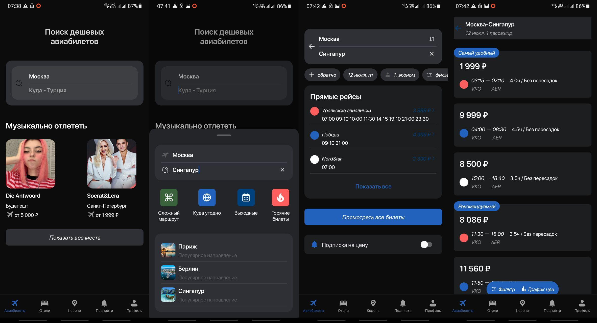

# :airplane: AviaTickets - Purchasing Airline Tickets

Android native application as test to "Effective Mobile".

**Tech stack**: Kotlin, Retrofit, AdapterDelegates, Hilt, Coil, Jetpack Navigation and DataStore.

## :rocket: How to start?

1. Install JDK 17.
2. Open `/mock-server` and deploy it: `gradlew bootRun --args="--server.address=192.168.0.10 --server.port=8080"`, replace *address* and *port*.
3. Open `/android-client` and set server address in `dev.properties` file.
4. Run `gradlew assembleDebug` and install `/app/build/outputs/apk/debug/app-debug.apk`.